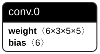

A minimal reproducible example of tracel-ai/burn#1270.

## How to reproduce

- Just execute `cargo run`.

## Explanation

- I use `gen.py` to generate this pt file: 
  
- It only contains a `Conv2d` layer with `conv.0` as key.
- Then I load it using burn-import, but I only have `conv0` as key.
- So I encountered OOM in the `burn_import::pytorch::reader::from_file` function.

I think the correct behavior here would be to fill the non-existent `conv0` with the default value, or return an error.
